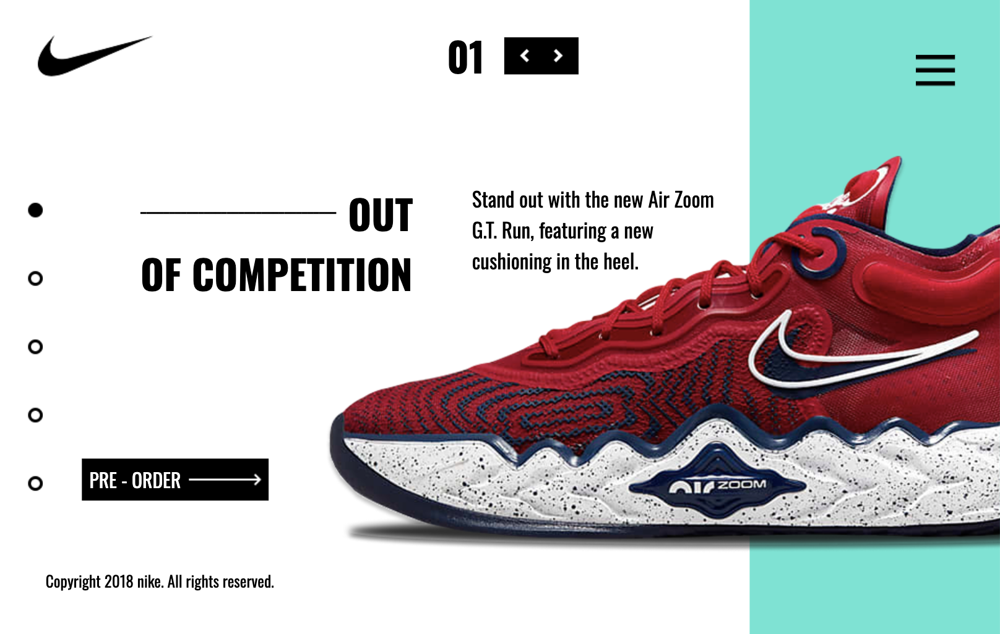
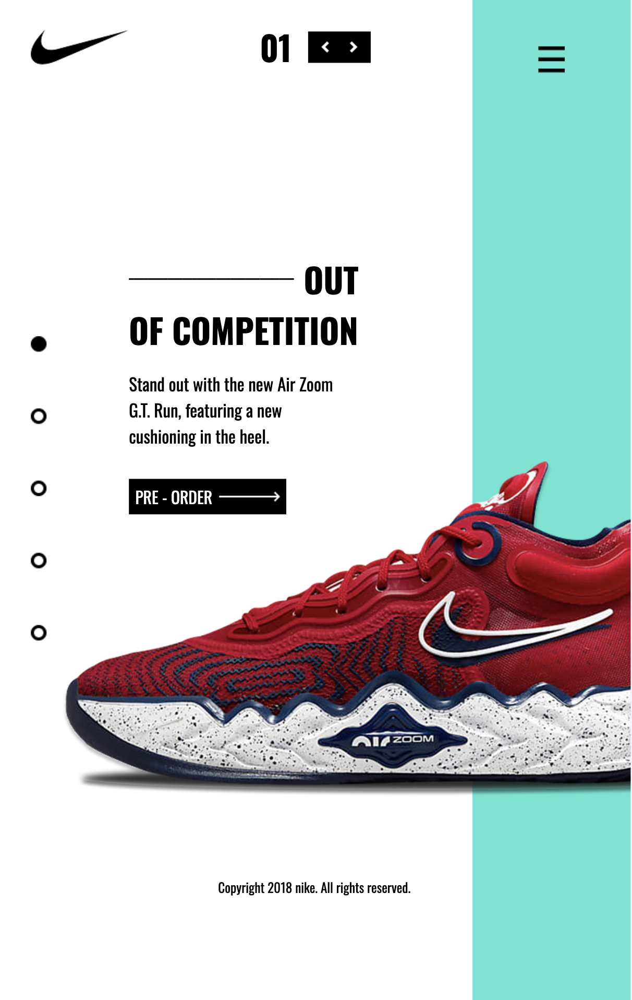
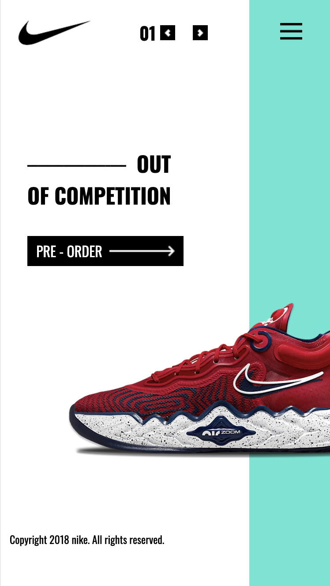

# Nike-tailwind

## Desktop

## Tablet

## Mobile

## Descrição
 Projeto usando tailwind.css para fazer uma página responsiva, desenvolvido durante as aulas na escola SENAI de Jandira.

 ## Tecnologias
* HTML
* Tailwind.css
* git
* Figma
& github

## Autor 
[Carlos Eduardo.](https://www.linkedin.com/in/carlos-eduardo-silva-pereira-a2413b353/)